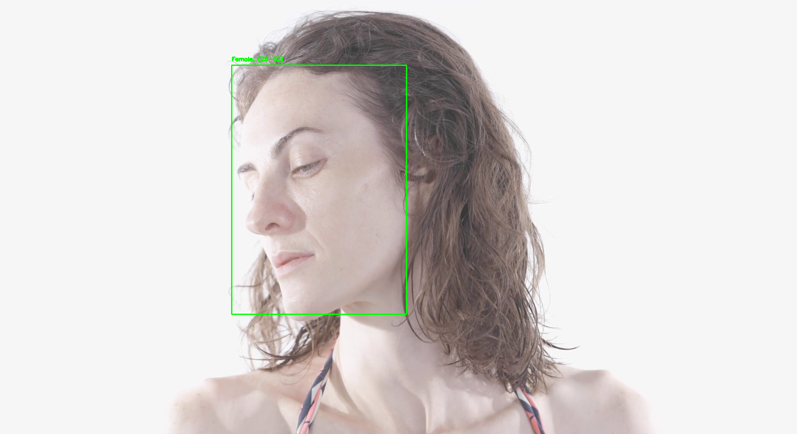
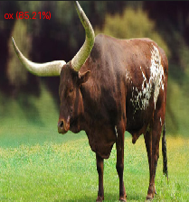

# AI Multitask Classifiers: From Objects to Emotions

Created by [Son Nguyen](https://github.com/hoangsonww) in 2024, this repository contains Python scripts for various AI-powered classifiers. These classifiers can be used for object detection, face detection, character recognition, and more. The classifiers are built using popular deep learning frameworks such as `OpenCV`, `TensorFlow`, and `PyTorch`.

This repository contains 8 subdirectories: one for vehicle classification, one for human face classification, one for mood classification, one for flower classification , one for object classification, one for character classification, one for animal classification, and one for speech recognition, namely `Vehicle-Classification`, `Human-Face-Classification`, `Mood-Classification`, `Flowers-Classification`, `Object-Classification`, `Character-Recognition`, `Animals-Classification`,  and `Speech-Recognition`. Refer to the information below for details on each classifier.

What's even more interesting is that all these classifiers can use your webcam for live testing, video files, or image files!

## Table of Contents

- [Vehicle Classification](#vehicle-classification)
  - [Files Included](#files-included)
  - [Getting Started](#getting-started)
  - [Output](#output)
- [Human Face Classification](#face-classification)
  - [Files Included](#files-included-1)
  - [Getting Started](#getting-started-1)
  - [Output](#output-1)
- [Mood Classification](#mood-classification)
  - [Files Included](#files-included-2)
  - [Getting Started](#getting-started-2)
  - [Output](#output-2)
- [Flower Classification](#flower-classification)
  - [Files Included](#files-included-3)
  - [Getting Started](#getting-started-3)
  - [Output](#output-3)
- [Object Classification](#object-classification)
  - [Files Included](#files-included-4)
  - [Getting Started](#getting-started-4)
  - [Output](#output-4)
- [Character Classification (OCR)](#character-classification)
  - [Files Included](#files-included-5)
  - [Getting Started](#getting-started-5)
  - [Output](#output-5)
- [Animal Classification](#animal-classification)
  - [Files Included](#files-included-6)
  - [Getting Started](#getting-started-6)
  - [Output](#output-6)
- [Speech Recognition](#speech-recognition)
  - [Files Included](#files-included-7)
  - [Getting Started](#getting-started-7)
  - [Output](#output-7)
- [Contact Information](#contact-information)
- [Future Work](#future-work)
- [License](#license)

---

## Vehicle Classification

### Files Included
- `coco.names`: Class names used for vehicle detection.
- `traffic.mp4`: Sample video for vehicle detection.
- `india.jpg`: Sample image for vehicle detection.
- `yolov3.cfg`: YOLOv3 model configuration file.
- `yolov3.weights`: Pre-trained YOLOv3 model weights.
- `vehicle_detection.py`: Python script for vehicle detection and classification.

### Getting Started

1. **Clone the Repository**
   ```bash
   git clone https://github.com/hoangsonww/AI-Classification.git
   cd AI-Classification/Vehicle-Classification
   ```

2. **Download Model Weights**
   Download the pre-trained YOLOv3 model weights (`yolov3.weights`) from the official YOLO website or another trusted source and place it in the `Vehicle-Classification` directory.

3. **Install Dependencies**
   Install the required Python dependencies.
   ```bash
   pip install -r requirements.txt
   ```

4. **Run Vehicle Detection**
   ```bash
   python vehicle_detection.py
   ```
   
You will then be asked to choose your input type (image, video, or webcam). Enter `image` to classify the vehicles in the sample video provided (`traffic.mp4`), or enter `video` to classify vehicles in a video file. You can also use your webcam for live testing.

All our classifiers will only stop when you press `Q`, `ESC`, or otherwise close the window.

### Output

The output video will display the detected vehicles along with their class labels. The class labels are based on the COCO dataset, which includes various classes such as car, truck, bus, motorcycle, and bicycle.

Example output:

<p align="center">
  
</p>

---

## Face Classification

### Files Included
- `deploy.prototxt`: Model configuration file for the face detector.
- `res10_300x300_ssd_iter_140000.caffemodel`: Pre-trained model weights for face detection.
- `age_deploy.prototxt`: Model configuration file for age prediction.
- `age_net.caffemodel`: Pre-trained model weights for age prediction.
- `gender_deploy.prototxt`: Model configuration file for gender prediction.
- `gender_net.caffemodel`: Pre-trained model weights for gender prediction.
- `faces_classification.py`: Python script for face detection, age, and gender classification.
- `woman-30.mp4`: Sample video for face classification
- `man.jpg`: Sample image for face classification.

### Getting Started

1. **Clone the Repository**
   ```bash
   git clone https://github.com/hoangsonww/AI-Classification.git
   cd AI-Classification/Face-Classification
   ```

2. **Download Model Weights**: Ensure you have the model weights (`res10_300x300_ssd_iter_140000.caffemodel`, `age_net.caffemodel`, `gender_net.caffemodel`) in the `Human-Face-Classification` directory.

3. **Install Dependencies**: Install the required Python dependencies.

    ```
    pip install -r requirements.txt
    ```

4. **Run Face Classification**: Execute the face_classification.py script.

    ```
    python face_classification.py
    ```

You will then be asked to choose your input type (image, video, or webcam). Enter `image` to classify the faces in the sample image provided (`woman-30.mp4`), or enter `video` to classify faces in a video file. You can also use your webcam for live testing.

All our classifiers will only stop when you press `Q`, `ESC`, or otherwise close the window.

### Output

The output will be a video displaying the detected faces along with their estimated age and gender.

Example output:

<p align="center">
  
</p>

---

## Mood Classification

### Files Included

- `mood_classifier.py`: Python script for mood classification.
- `angry.mp4`: Sample video for mood classification (angry).
- `surprised.jpg`: Sample image for mood classification (surprised).

### Getting Started

1. **Clone the Repository**
   ```bash
   git clone
   cd AI-Classification/Mood-Classification
    ```
2. **Install Dependencies**
    Install the required Python dependencies.
    ```bash
    pip install -r requirements.txt
    ```
3. **Run Mood Classification**
    ```bash
    python mood_classifier.py
    ```
   
You will then be asked to choose your input type (image, video, or webcam). Enter `image` to classify the mood in the sample image provided (`surprised.jpg`), or enter `video` to classify the mood in a video file. You can also use your webcam for live testing.

The script will then display the detected mood in the image, video, or webcam stream and in the console.

All our classifiers will only stop when you press `Q`, `ESC`, or otherwise close the window.

### Output

The output will be displayed the detected mood in the image, video, or webcam stream and in the console.

Example output:

<p align="center">
  
</p>

## Character Classification

### Files Included
- `ocr.py`: Python script for character classification.
- `OIP.jpg`: Sample JPEG image for character classification.
- `chars.jpg`: Sample JPEG image for character classification.
- `chars.mp4`: Sample video for character classification.
- `letters.mp4`: Sample video for character classification.

### Getting Started

1. **Clone the Repository**
   ```bash
   git clone
   cd AI-Classification/Character-Recognition
    ```
2. **Install the required Python dependencies.**
   ```bash
   pip install -r requirements.txt
   ```
3. **Install Tessaract OCR**
    - For Windows: Download and install the Tesseract OCR executable from the [official Tesseract OCR website](https://github.com/UB-Mannheim/tesseract/wiki).
    - For Linux: Install Tesseract OCR using the package manager.
      ```bash
      sudo apt-get install tesseract-ocr
      ```
    - For macOS: Install Tesseract OCR using Homebrew.
      ```bash
        brew install tesseract
        ```
    - This is required for the OCR functionality to work. Also, when you install, note down the installation path of the Tesseract OCR executable. Replace the path in the `pytesseract.pytesseract.tesseract_cmd` variable in the `ocr.py` script with yours.
4. **Run Character Classification**
    ```bash
    python ocr.py
    ```
    You will then be asked to choose your input type (image, video, or webcam). Enter `image` to classify the characters in the sample image provided (`OIP.jpg`), or enter `video` to classify characters in a video file. You can also use your webcam for live testing.

    ```
    image
    ```

The script will then display the detected characters in the image, video, or webcam stream.

All our classifiers will only stop when you press `Q`, `ESC`, or otherwise close the window.

### Output

The output will display the class labels of the characters detected in the image along with the confidence scores.

Example output:

<p align="center">
  
</p>

---

## Flower Classification

### Files Included
- `flower_classification.py`: Python script for flower classification.
- `daisy.jpg`: Sample JPEG image for flower classification (Daisy).
- `marigold.jpg`: Sample JPEG image for flower classification (Marigold).
- `rose.mp4`: Sample video for flower classification (Rose).

### Getting Started

1. **Clone the Repository**
   ```bash
   git clone https://github.com/hoangsonww/AI-Classification.git
   cd AI-Classification/Flowers-Classification
   ```

2. **Install Dependencies**
   Install the required Python dependencies.
   ```bash
   pip install -r requirements.txt
   ```

3. **Run Object Classification**
   ```bash
   python flower_classification.py
   ```
   
You will then be asked to choose your input type (image, video, or webcam). Enter `image` to classify the flowers in the sample image provided (`daisy.jpg`), or enter `video` to classify flowers in a video file. You can also use your webcam for live testing.

All our classifiers will only stop when you press `Q`, `ESC`, or otherwise close the window.

### Output

The output will display the class label of the flower detected in the image along with the confidence score.

Example output: Here are the sample image of Daisy flowers.

<p align="center">
  
</p>

---

## Object Classification

### Files Included
- `object_classification.py`: Python script for object classification.
- `objects.jpg`: Sample JPEG image for object classification.
- `objects.png`: Sample PNG image for object classification.
- `balls.mp4`: Sample video for object classification.
- `OIP.jpg`: Sample image for object classification.

### Getting Started

1. **Clone the Repository**
   ```bash
   git clone https://github.com/hoangsonww/AI-Classification.git
   cd AI-Classification/object_classification
   ```

2. **Install Dependencies**
   Install the required Python dependencies.
   ```bash
   pip install -r requirements.txt
   ```

3. **Run Object Classification**
   ```bash
   python object_classification.py
   ```
   
You will then be asked to choose your input type (image, video, or webcam). Enter `image` to classify the objects in the sample image provided (`objects.jpg`), or enter `video` to classify objects in a video file. You can also use your webcam for live testing.

Feel free to change the paths and other parameters in the script to suit your needs.

**Note:** All our classifiers will only stop when you press `Q`, `ESC`, or otherwise close the window.

### Output

The output will display the class labels of the objects detected in the image along with the confidence scores. Or, if you choose to use your webcam, the output will display the class labels of the objects detected in the video stream. If you choose to use a video file, the output will be a video displaying the detected objects along with their class labels.

Example output:

<p align="center">
  
</p>

---

## Animal Classification

### Files Included
- `animal_classification.py`: Python script for animal classification.
- `cow.jpg`: Sample JPEG image for animal classification (Cow).
- `ox.jpg`: Sample JPEG image for animal classification (Ox).

### Getting Started

1. **Clone the Repository**
   ```bash
   git clone https://github.com/hoangsonww/AI-Classification.git
   cd AI-Classification/Animals-Classification
   ```

2. **Install Dependencies**
   Install the required Python dependencies.
   ```bash
   pip install -r requirements.txt
   ```

3. **Run Object Classification**
   ```bash
   python animal_classification.py
   ```

The script will then ask you to choose your input type (image, video, or webcam). Enter `image` to classify the animals in the sample image provided (`cow.jpg`), or enter `video` to classify animals in a video file. You can also use your webcam for live testing.

All our classifiers will only stop when you press `Q`, `ESC`, or otherwise close the window.

### Output

The output will display the class labels of the animals detected in the image along with the confidence scores.

Example output:

<p align="center">
  
</p>

---

## Speech Recognition

### Files Included
- `speech_classifier.py`: Python script for speech recognition.
- `speech.mp4`: Sample video file for speech recognition in a video context.
- `temp_audio.wav`: Temp audio file (used by our AI) for speech recognition.

### Getting Started

1. **Clone the Repository**
   ```bash
   git clone https://github.com/hoangsonww/AI-Classification.git
   cd AI-Classification/Speech-Recognition
   ```

2. **Install Dependencies**
   Install the required Python dependencies.
   ```bash
   pip install -r requirements.txt
   ```
   
3. **Run Speech Recognition**
   ```bash
    python speech_classifier.py
    ```

You will then be asked to choose your preferred input method (microphone or video). Enter `microphone` to use your microphone for live speech recognition, or enter `video` to use a video file for speech recognition.

### Output

You will see the output of the speech recognition process in the console. The script will display the recognized speech from the audio input. The audio is processed in chunks and recognized in real-time. All our classifiers will stop when you press `Q`, `ESC`, or otherwise close the window.

Example output:

<p align="center">
  
</p>

## Contact Information

For any questions or issues, please contact:
- Name: [Son Nguyen](https://github.com/hoangsonww)
- Email: [info@movie-verse.com](mailto:info@movie-verse.com)

## Future Work

- Add more classifiers for various tasks such as emotion recognition, sentiment analysis, and more.
- Refine existing classifiers and improve their accuracy and performance.
- Add more sample images and videos for testing the classifiers.

## License

This project is licensed under the MIT License - see the [LICENSE](LICENSE) file for details.

---

This repository is a work in progress and under active development. If you have any suggestions or improvements, feel free to contribute to this repository. Thank you for visiting!
